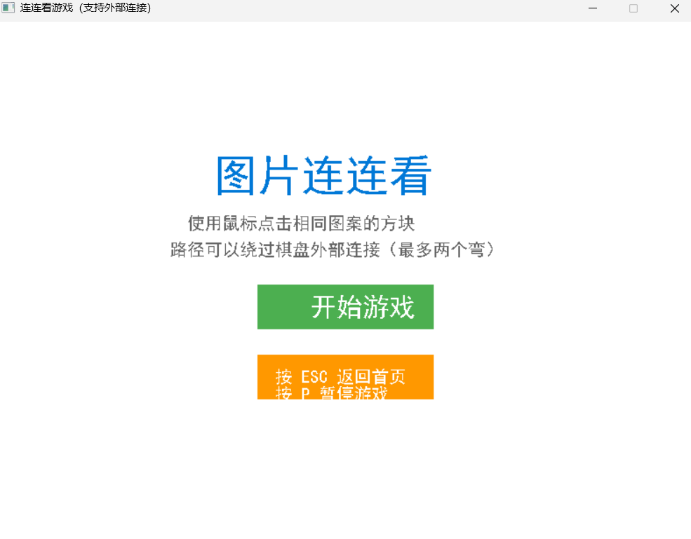
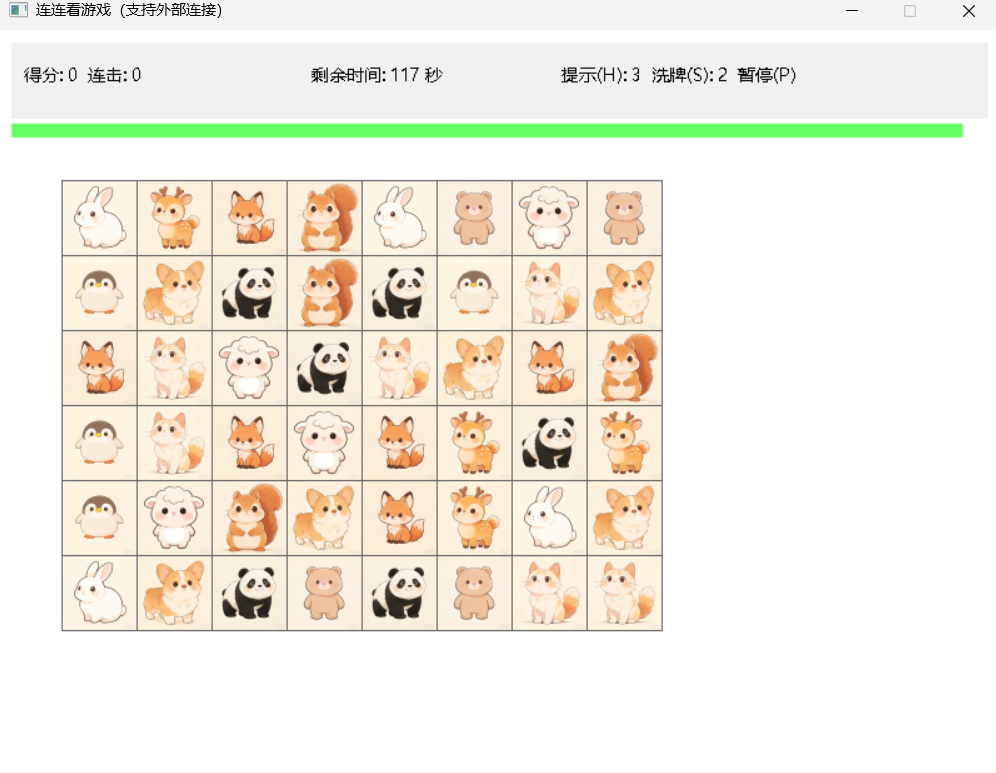
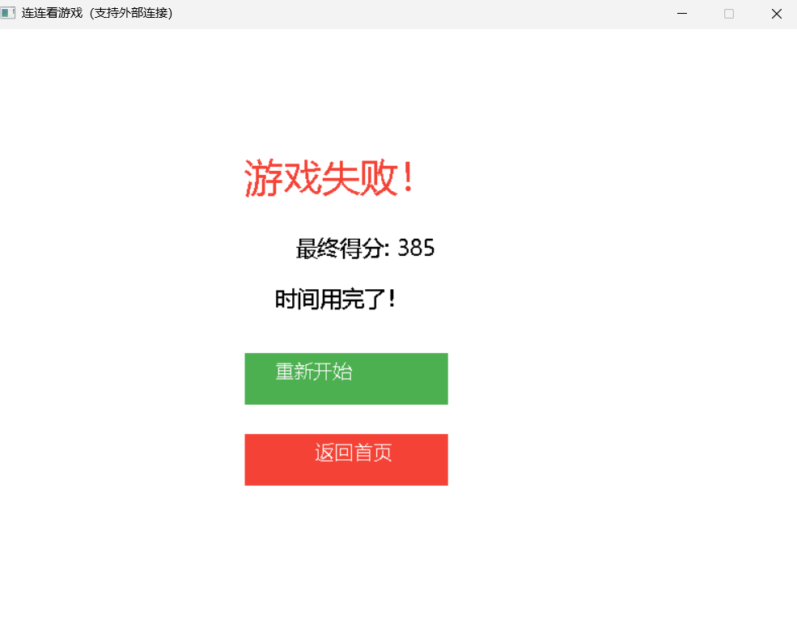

# EasyX连连看小游戏
基于C++ + EasyX图形库实现的经典连连看项目，完整实现原版连连看连通规则，支持道具、计分、多界面、倒计时等全套游戏功能。

## 📖 项目介绍
本项目采用6行8列棋盘布局，实现**直线/单拐点/双拐点/棋盘外侧绕路**四种连通消除规则，内置计分连击系统、提示&洗牌道具、三级难度、多页面状态切换（开始/游戏/暂停/胜利/失败），课程设计完整成品。

## ⚙️ 运行环境
- 系统：Windows 10/11
- 编译软件：Visual Studio 2019/2022
- 依赖库：EasyX图形库

## 📁 项目文件目录
- lianliankan.sln        VS 项目解决方案
- .gitignore            Git 忽略配置
- README.md             项目说明文档
- lianliankan/
  - lianliankan.vcxproj      VS 工程文件
  - lianliankan.vcxproj.filters
  - lianliankan.vcxproj.user
  - 源.cpp                 连连看完整源码
  - images/                图片素材（1~10.png）

## 🎮 操作说明
|按键|功能|
|----|----|
|鼠标左键|选中/消除方块、点击界面按钮|
|H/h|使用提示道具，自动标出一对可消除方块|
|S/s|使用洗牌道具，打乱剩余方块布局|
|P/p|暂停当前游戏|
|ESC|返回游戏首页|

## ✨ 功能亮点
1. **完整连通算法**：支持最多两个拐点、棋盘边界外绕路匹配，还原正版连连看规则
2. **计分连击机制**：连续消除叠加得分，匹配失败清空连击
3. **道具系统**：提示、洗牌两种道具，不同难度道具数量不同
4. **三级难度**：简单/中等/困难，限时、得分倍率、道具数量自动区分
5. **完整状态页**：开始界面、游戏界面、暂停、胜利、失败五大界面自由切换
6. **倒计时系统**：实时剩余时间+彩色进度条，超时判定游戏失败
7. **死局判定**：无可用配对方块直接判定失败

## 🚀 编译运行步骤
1. 下载项目源码，使用VS双击打开 `lianliankan.sln`
2. 项目提前配置好EasyX图形库环境
3. 直接生成+运行即可启动游戏

## 📌 游戏胜负规则
- 胜利：棋盘所有方块全部消除完毕
- 失败①：倒计时剩余时间归零
- 失败②：棋盘剩余方块无任何可配对消除

## 🖼️ 运行效果图

## 📝 项目用途
C++课程设计、EasyX实训作业、C语言大作业参考源码
